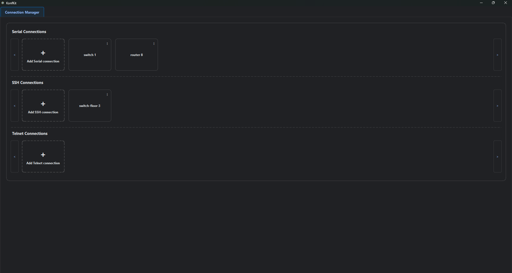
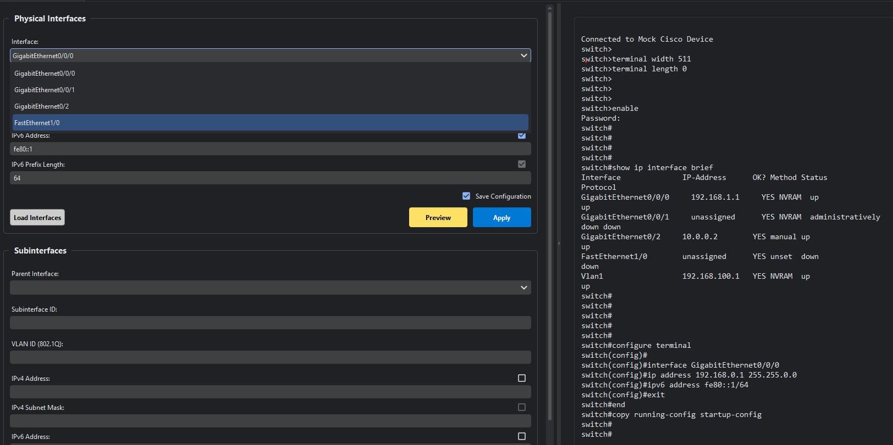
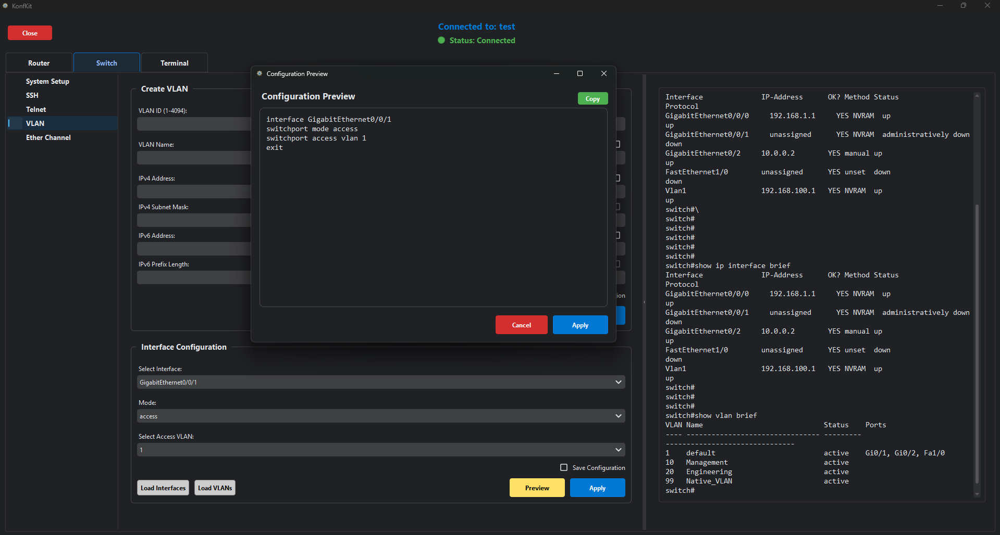

# KonfKit

**Author:** Zhao Xiang Yang  
**About:** This project was developed as part of a school project for SPŠE Ječná in 2025/2026. Please note that it serves primarily as an educational exercise and may not be actively maintained.

KonfKit is a robust, GUI-based network management and configuration tool designed to streamline the provisioning and administration of network devices. By abstracting complex Command Line Interface (CLI) commands into an intuitive visual interface, KonfKit reduces configuration errors and accelerates deployment times. Whether you are managing complex routing protocols, access control lists, or switch port parameters, KonfKit provides a unified platform to interact with and configure your network infrastructure efficiently.

## Screenshots

### Connection Manager

### Configuration Builder

### Command Preview

## Features

* **Multi-Protocol Support:** Connect to devices via SSH, Telnet, or Serial interfaces.
* **Connection Profile Manager:** Save, organize, and quickly load connection credentials and settings for multiple devices.
* **Integrated Terminal:** Interact directly with device command-line interfaces.
* **Automated Router Configuration:** Visual builders for OSPF, NAT, DHCP, ACLs, HSRP, interfaces, and Static Routing.
* **Automated Switch Configuration:** Visual builders for VLANs and EtherChannel.
* **Universal Device Settings:** Easily configure universal parameters like SSH, Telnet, and basic system settings.

## Built With

* **Python 3** - Core language
* **PyQt6** - GUI framework
* **Netmiko** - Multi-vendor library for simplified SSH/Telnet connections
* **PySerial** - Support for serial console connections

## Installation

**Standalone (Recommended):**
Download the latest standalone executable from the [Releases](../../releases) page. Run the executable to start the application.

**From Source:**
1. Clone the repository.
2. Install the required dependencies (e.g., PyQt6, netmiko, pyserial).
3. Run `python main.py` from the root directory.

## Usage

1. Launch **KonfKit**.
2. Go to the **Connection Manager** to define your device profiles, or establish a quick session using the **Terminal** tab.
3. Once connected, use the **Config Tab** to select the desired feature (e.g., OSPF, VLANs), enter the parameters in the UI, and push the configuration directly to the target device.

## License

Please refer to the `LICENSE` file in the repository for details.
